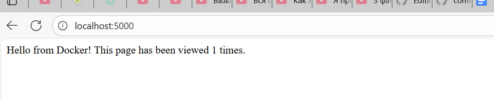

# Практичне заняття «Робота з Dockerfile та Docker Compose»

"Мета": Навчитися працювати з директивами Dockerfile і запускати багатосервісний застосунок (Flask + Redis) за допомогою Docker Compose.

## Хід роботи

1) Створено файл `app.py`
2) Створено `dockerfile`
3) Створено `docker‑compose.yml`
4) У терміналі виконано команду: 
`docker compose up --build`
5) У терміналі виконано команду:
`docker compose down`

## Скріншот лічильника в браузері

## Висновок 
У цій роботі вдалося запустити двосервісний застосунок (Flask + Redis) за допомогою Docker Compose. Під час виконання завдання я навчився створювати Dockerfile для контейнеризації Python-застосунку та налаштовувати файл docker-compose.yml для взаємодії між сервісами. Успішна робота лічильника переглядів у браузері підтвердила, що контейнери взаємодіють правильно.
